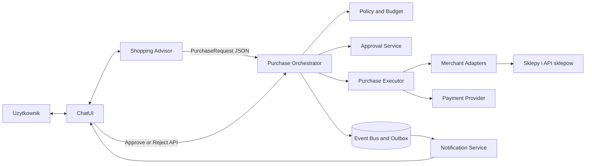
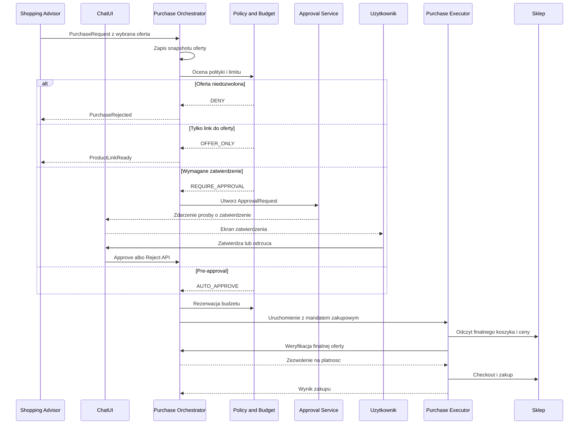
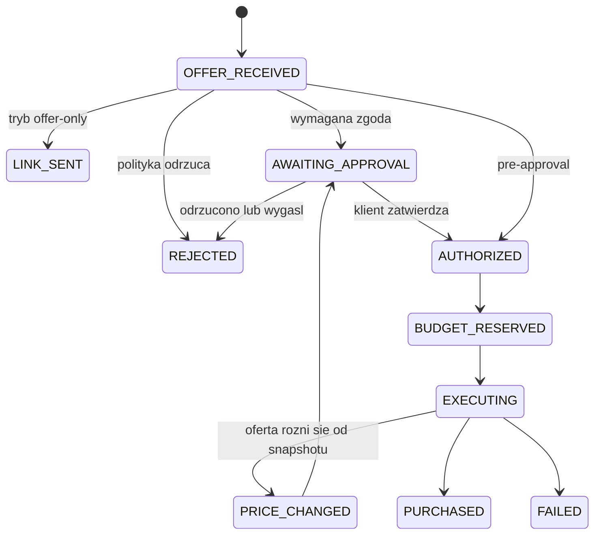

# Architektura zakupow agenta

## Cel i zasada odpowiedzialnosci

System sklada sie z trzech niezaleznych aplikacji: ChatUI, Shopping Advisor i Purchase Orchestrator. ChatUI prowadzi interakcje z klientem, Advisor wybiera oferte, a Orchestrator kontroluje i wykonuje zakup. Granica miedzy nimi jest celowa:

> Shopping Advisor rekomenduje, Purchase Orchestrator autoryzuje, a Purchase Executor realizuje zakup.

Model LLM nie ma dostepu do platnosci, limitow ani prawa do uruchomienia checkoutu. Moze jedynie utworzyc propozycje zakupu.

## Komponenty



### ChatUI

Osobna aplikacja odpowiedzialna za interfejs konwersacji i komunikacje z klientem. Wyswietla wiadomosci i karty ofert, odbiera akcje klienta oraz przyjmuje zdarzenia z Orchestratora, np. prosbe o zatwierdzenie i wynik zakupu. Przekazuje zatwierdzenie lub odrzucenie do API Orchestratora. Nie podejmuje decyzji zakupowych.

### Shopping Advisor

Osobna aplikacja API z komponentem LLM/agentowym dla etapu przed zakupem. Prowadzi dialog przez ChatUI, zbiera wymagania, wyszukuje i porownuje oferty oraz przekazuje wybrana oferte do Purchase Orchestrator jako `PurchaseRequest` JSON. Nie ma dostepu do danych platniczych, polityk ani executora.

### Purchase Orchestrator

Wlasciciel procesu zakupu i zrodlo prawdy o jego stanie. Zapisuje snapshot oferty, ocenia polityke autonomii, rezerwuje budzet, obsluguje zatwierdzenie klienta, tworzy mandat zakupowy, uruchamia executor i zapisuje wynik.

### Policy and Budget

Przechowuje polityke autonomii uzytkownika: limity kwotowe, dozwolone sklepy i kategorie, wymaganie zatwierdzenia oraz ograniczenia, np. zakaz subskrypcji. Rezerwuje budzet atomowo przed uruchomieniem zakupu.

### Approval Service

Tworzy jednorazowy, ograniczony czasowo token zatwierdzenia lub odrzucenia konkretnego zakupu. Orchestrator wysyla prosbe do ChatUI przez outbox i endpoint ChatUI; ChatUI wywoluje endpoint `approve` albo `reject` Orchestratora. Zgoda jest zwiazana z niezmiennym snapshotem oferty.

### Purchase Executor

Asynchroniczny worker wykonujacy checkout. Dostaje tylko krotkotrwaly mandat zakupowy ograniczony do jednego zakupu. Przed platnoscia ponownie odczytuje finalne dane koszyka i prosi Orchestrator o zgode na platnosc.

### Merchant Adapters

Integracje ze sklepami realizowane w kolejnosci preferencji:

1. Dedykowany adapter dla strategicznych sklepow, np. Amazon.
2. Adapter oficjalnego API sklepu.
3. Adapter platformowy, np. Shopify.
4. Automatyzacja przegladarki jako fallback.

LLM moze pomoc w automatyzacji przegladarki, ale nie moze samodzielnie zatwierdzac wariantu, ceny ani platnosci.

## Przeplyw zakupu



Finalna oferta musi odpowiadac snapshotowi. Zmiana ceny, wariantu, sprzedawcy, adresu, waluty, dostawy, podatku albo wykrycie subskrypcji zatrzymuje proces. Orchestrator odrzuca zakup albo tworzy nowe zadanie zatwierdzenia, zalezne od polityki.

## Zatwierdzenie i mandat zakupowy

`Approval Service` przekazuje ChatUI token i dane potrzebne do wyswietlenia ekranu podsumowania. ChatUI wywoluje API `approve` lub `reject`; samo wyswietlenie komunikatu nie powoduje zakupu.

Mandat zakupowy jest zapisem serwerowym lub podpisanym tokenem powiazanym z:

- `purchaseId` i hashem snapshotu oferty;
- maksymalna kwota i waluta;
- konkretnym sklepem;
- dozwolonymi akcjami: `CREATE_CART`, `CHECKOUT`, `PAY`;
- terminem waznosci;
- zasada jednokrotnego uzycia.

Executor nie dostaje ogolnego dostepu do konta sklepu ani trwalego prawa do wydawania pieniedzy.

## Stany zakupu



## Kontrakty miedzy modulami

Shopping Advisor tworzy tylko propozycje zakupu:

```json
{
  "userId": "usr_123",
  "conversationId": "conv_123",
  "offer": {
    "merchant": "amazon.com",
    "productUrl": "https://...",
    "merchantProductId": "B0...",
    "variant": "black",
    "quantity": 1,
    "totalAmount": 10.00,
    "currency": "USD"
  },
  "deliveryAddressId": "addr_456",
  "checkout": {
    "deliveryAddress": {
      "recipientName": "Jan Kowalski",
      "email": "jan@example.com",
      "phone": "+48111222333",
      "addressLine1": "Testowa 1",
      "postalCode": "00-001",
      "city": "Warszawa",
      "countryCode": "PL"
    },
    "productConfiguration": {
      "options": {"rodzaj": "Płótno"},
      "personalization": {"uwagi": "..."},
      "uploadAssetIds": ["asset_123"]
    },
    "preferredShippingMethod": "kurier",
    "preferredPaymentMethod": "Przelewy24",
    "acceptTerms": false
  }
}
```

Shopping Advisor przekazuje kompletne instrukcje checkoutu i niezmienny snapshot oferty. Identyfikatory plikow sa rozwiazywane na sciezki dopiero przez zaufany worker; LLM nie otrzymuje dowolnego dostepu do systemu plikow. Wartosci formularzy pochodza wylacznie z nazwanych pol snapshotu, a nie z tekstu wygenerowanego przez model.

Browser adapter realizuje kazdy krok jako petle obserwacji, planowania, wykonania i weryfikacji. LLM interpretuje semantyke strony oraz wybiera ograniczona akcje, ale wynik potwierdza kod Playwrighta. Niepowodzenie weryfikacji wraca do modelu jako kontekst kolejnej decyzji; powtarzajace sie niepowodzenia zatrzymuja proces.

Purchase Orchestrator zwraca status procesu:

```json
{
  "purchaseId": "pur_123",
  "status": "AWAITING_APPROVAL",
  "approvalUrl": "https://app.example.com/purchase-approvals/..."
}
```

Do komunikacji asynchronicznej nalezy publikowac wersjonowane zdarzenia, np. `purchase.approval_requested`, `purchase.approved`, `purchase.executing`, `purchase.completed`, `purchase.failed` i `purchase.price_changed`. `conversationId` pozwala ChatUI dostarczyc komunikat do poprawnej rozmowy.

## Wdrozenie i wlasnosc zespolowa

ChatUI, Shopping Advisor i Purchase Orchestrator sa osobno wdrazanymi aplikacjami. Wewnatrz Purchase Orchestrator moduly Policy and Budget, Approval Service, Executor i Merchant Adapters pozostaja na poczatku modularnym monolitem z osobnym workerem executora. Kontrakty wewnetrzne powinny zachowac granice przyszlych uslug.

```text
application/
  chat-ui/                 # osobna aplikacja
  shopping-advisor/        # osobna aplikacja
  purchase-orchestrator/
    policy-and-budget/
    approval-service/
    purchase-executor/
    merchant-adapters/
```

Naturalny podzial pracy:

- osoba 1: ChatUI i jego API;
- osoba 2: Shopping Advisor oraz narzedzia wyszukiwania;
- osoba 3: Purchase Orchestrator, Policy and Budget, Approval Service oraz Purchase Executor.

## Wymagania bezpieczenstwa i niezawodnosci

- Nie przechowywac danych karty; korzystac z tokenizacji PSP albo mechanizmu platnosci sklepu.
- Wszystkie komendy zakupowe musza byc idempotentne.
- Rezerwacja budzetu musi byc atomowa i zwalniana po bledzie lub wygasnieciu.
- Zmiana polityki uniewaznia niewykorzystane mandaty, gdy zmiana ogranicza uprawnienia.
- Przechowywac audyt: snapshot, wersje polityki, decyzje, zgode klienta, rezerwacje, finalna oferte i wynik zakupu.
- Notyfikacje wysylac przez outbox/event bus, aby awaria e-maila lub push nie blokowala zakupu.
